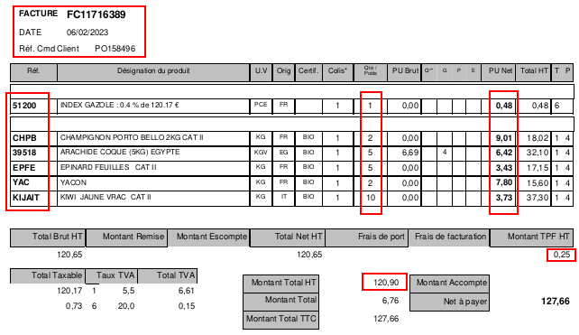
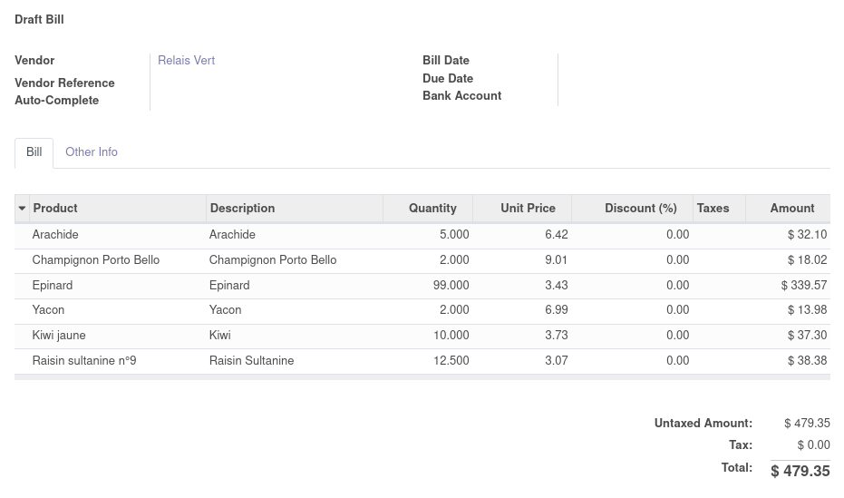

Consider the following use case.

**The PDF Invoice sent by your supplier**

**The Odoo Invoice generated from the Purchase Order**

* Go to "Invoicing > Vendors > Bills"

* Select an invoice and click on "Action > Update Based on the PDF of the supplier"

1. PDF Selection

    * Click "Upload your file" to select a PDF
    * Click on "Import" button

    .. figure:: ../static/description/wizard_step_1_pdf_import.png

2. Product mapping

    * The wizard will guess producs, based on the ``product_code`` of the selected supplier.

    * If the supplierinfo is not found, a step ask to mention which product corresponds
      to the invoice line.
      you have to link each supplier invoice line to an existing product (or create a new one).
    * Click on "Map Products"

    .. figure:: ../static/description/wizard_step_2_product_mapping.png

3. Summary before update

    The last screen display all the changes that will be done on the Odoo invoice.

    For the lines present in the supplier invoice, it will create or update existing lines.
    The lines present in Odoo but not in the supplier invoice will be removed.

    * Finally, click on "Apply Changes"

    .. figure:: ../static/description/wizard_step_3_summary.png
