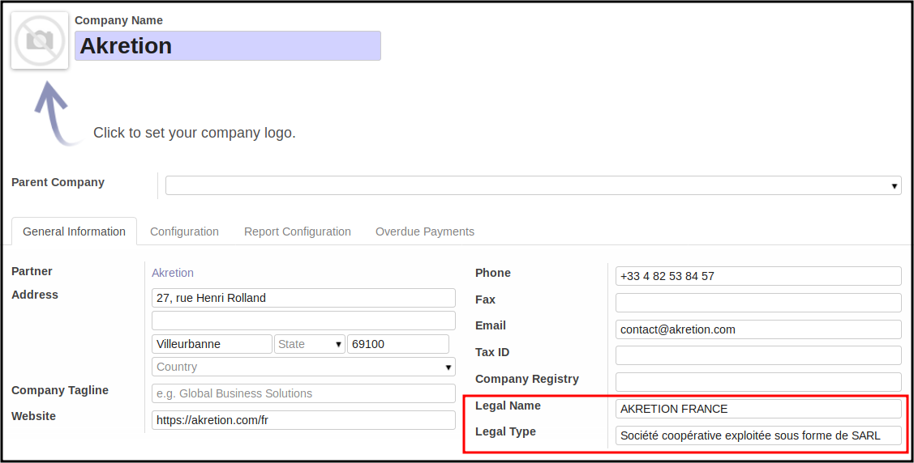
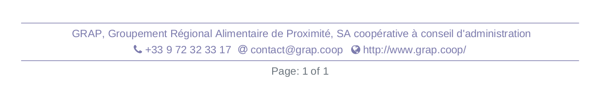

.. image:: https://img.shields.io/badge/licence-AGPL--3-blue.svg
   :target: http://www.gnu.org/licenses/agpl-3.0-standalone.html
   :alt: License: AGPL-3

================================
Base - Company legal Information
================================

This module adds legal fields on companies :

* ``legal_name`` : Also called 'Official Name' or 'Business Name', used
  in official documents

* ``legal_type`` : to mention the juricial form of the company :
  Ltd ('Limited company' in many countries),
  SARL ('Société Anonyme à Responsabilité Limitée' in France),
  GmbH ('Gesellschaft mit beschränkter Haftung' in germany, Austria),
  etc.

With that design, you can now use the ``name`` field for the Trade name
of your companies.

Usage
=====

* go to the company form view and set the new information.

* The new informations are now available in the external Layout
  used for official reports. (quotation, invoices, etc.)

If you create your custom report, you can call the new computed field
``report_legal_description``

Credits
=======

Contributors
------------

* Alexis de Lattre <alexis.delattre@akretion.com>
* Sylvain LE GAL <https://twitter.com/legalsylvain>

Funders
-------

The development of this module has been financially supported by:

* Akretion (http://www.akretion.com)
* GRAP, Groupement Régional Alimentaire de Proximité (http://www.grap.coop)
