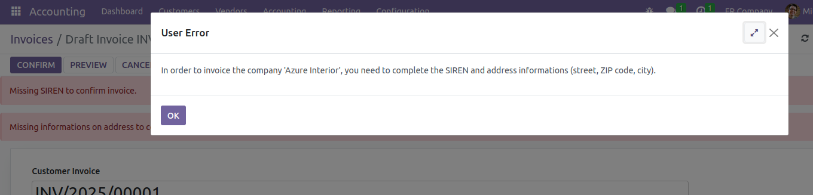
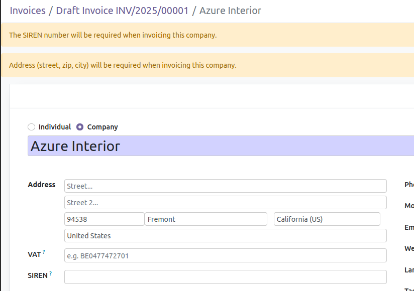
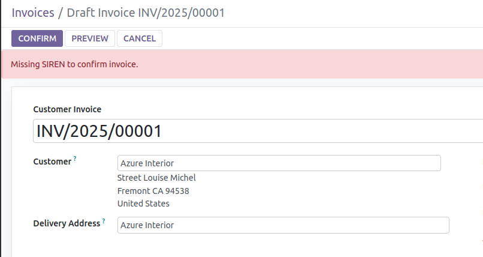

This module blocks account move to be confirmed if customer is a company
and lacks required informations for French law : SIREN, address.

It also warns user with alert panel when creating contact and invoice
with missing informations.

