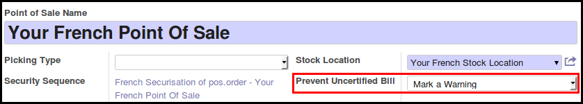

To configure this module, you need to:

#. Set an extra key in ``openerp.cfg`` configuration file named 
   ``l10n_fr_certification_mode`` with the following value:

* ``legacy``: Configuration is on each PoS config. (Default value, if not found)
* ``warning``: The bill will display the hash of the order on the bill
  or a warning, if the server is unreachable.
* ``block``: The bill will not be printed, if the server is unreachable.

#. Go to 'Point Of Sale' / 'Configuration' / 'Point of Sale' and edit your
   french PoS Configs, setting the correct setting for the field
   'Prevent Uncertified Bill'. This field will be used only if the server is
   set to the mode ``legacy``.

**Important note**

'block' setting will break offline mode.
