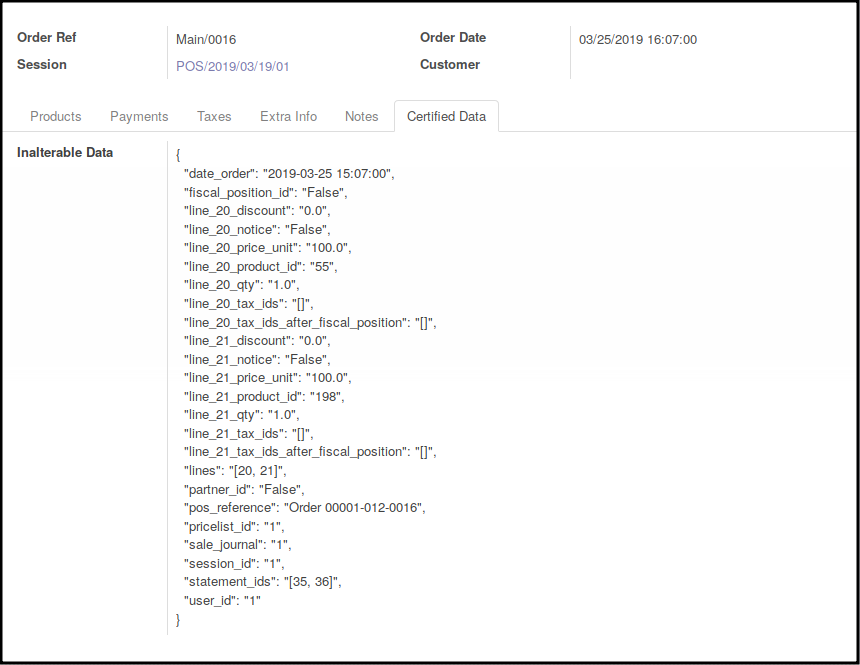
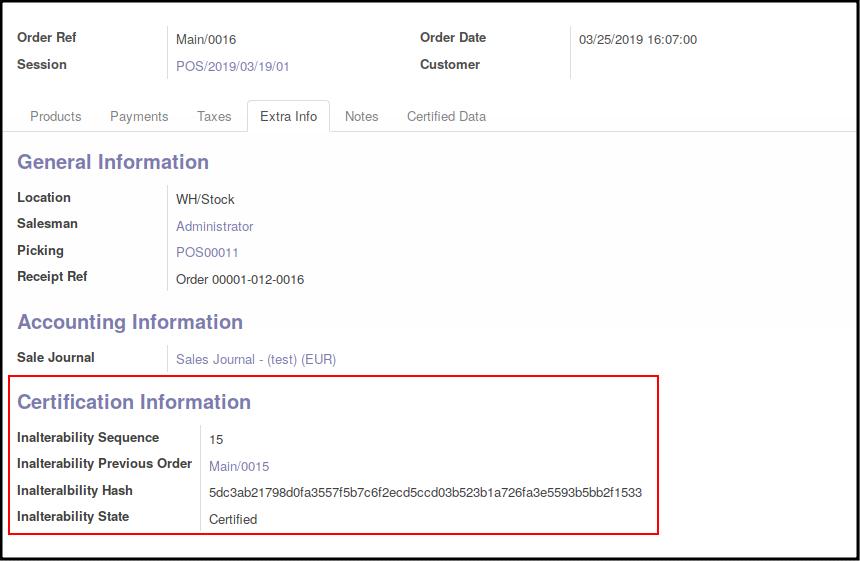
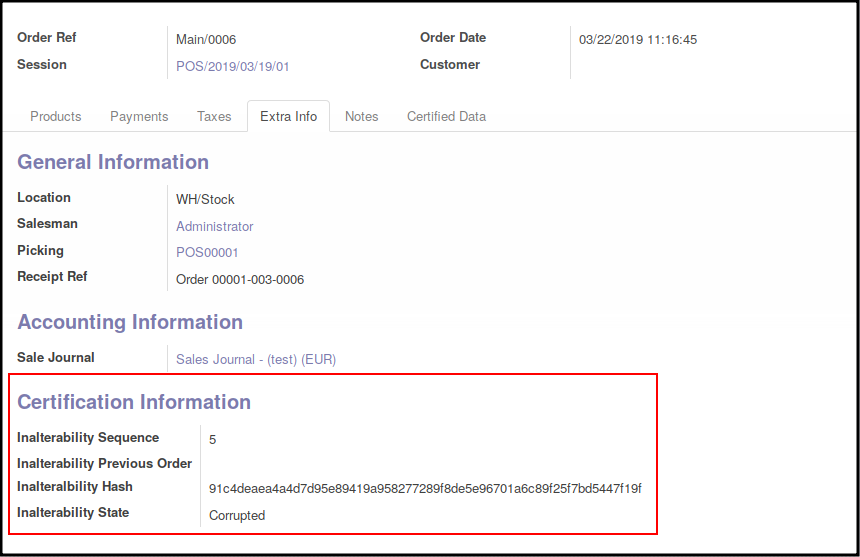

This module extends the functionality of Point of Sale module to feat with
the french Sapin law.

It extends the odoo module ``l10n_fr_cert_pos`` and add extra required
features :

- It allows to display the hash on the bill (See Usage part)

- It displays the hashed data

- It displays on the ``pos.order`` form the hash, and if the data
  has been corrupted or not.

**Certified Order**

**Corrupted Order**

