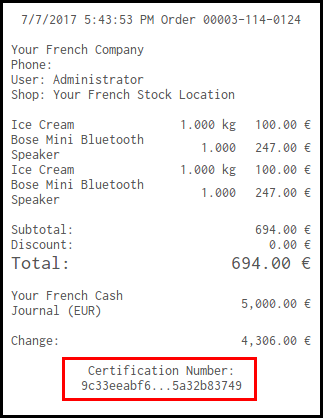
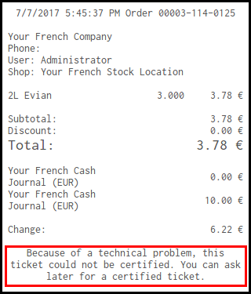
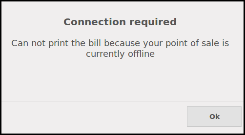

Depending of the settings, the french bills printed by the point of sale :

* will display an extract of the hash of the order.

* will display a warning text, if setting is set to 'warning'.

* will not be printed, if setting is set to 'block'.

