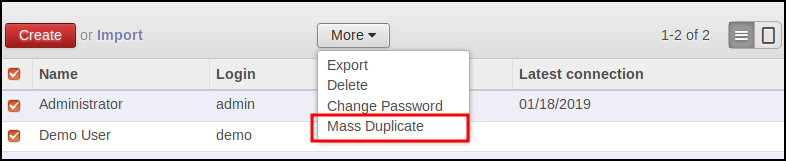
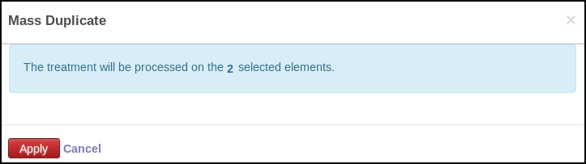
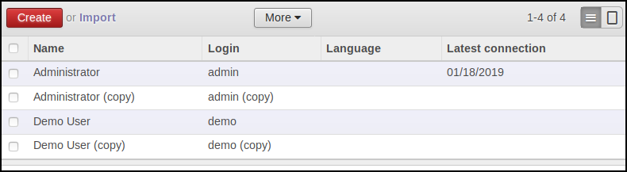

* go to the model for which you have configured a mass action

* select items and click on 'More' and on the new created button

* the opened pop up display the number of selected items

**Result**

It will display all the products associated to all the sale order lines
associated to the selected sale orders.

