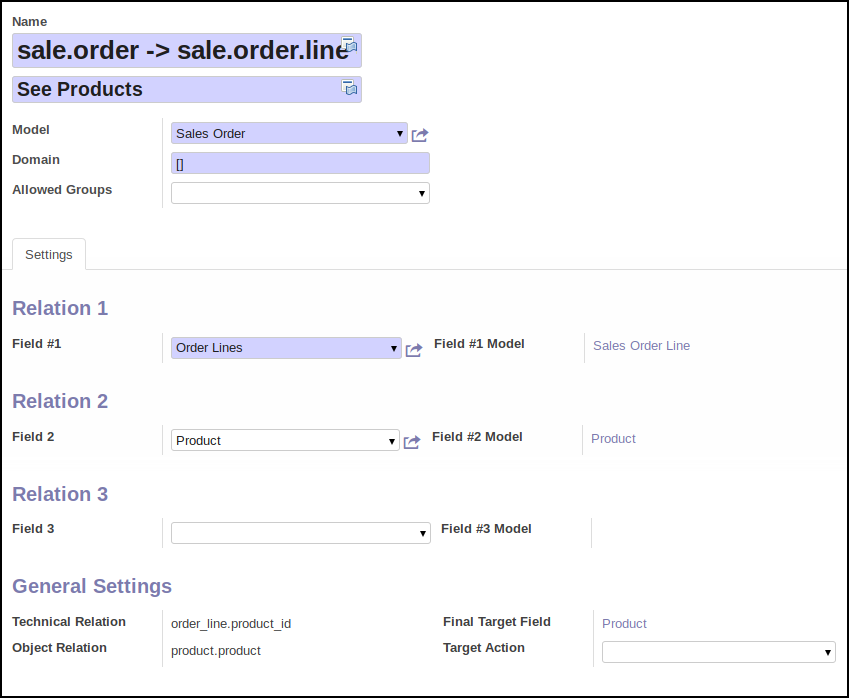

* Go to 'Setting / Technical / Mass Operations / Link'

* Create a new item

* Set a name for your link, and another for the button that will appear on the
  target model

* choose a model

* Then, select a field of this model. It can be a ``one2many``, ``many2many``,
  ``many2one`` field.

* You can then optionally select a field (#2) that belong to the previous
  selected field (#1) model

* You can then optionally select a field (#3) that belong to the previous
  selected field (#2) model

* Once done, click on the 'Add Sidebar button' to generate a new 'More options'
  button.

**Extra options**

* you can define a domain, to limit the link operation to items that match
  with that domain.
* you can define groups whose members will have access to that option.
* You can select an action that will be used to display the target field list.
