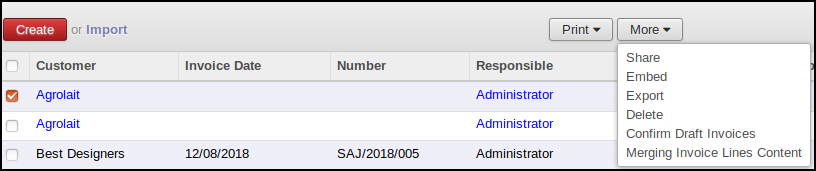
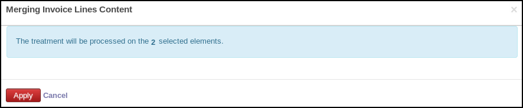
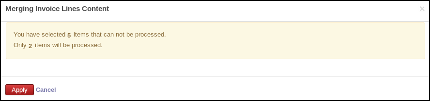
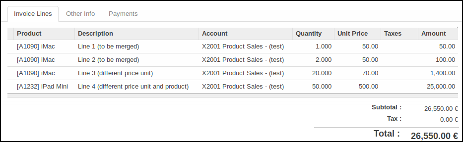
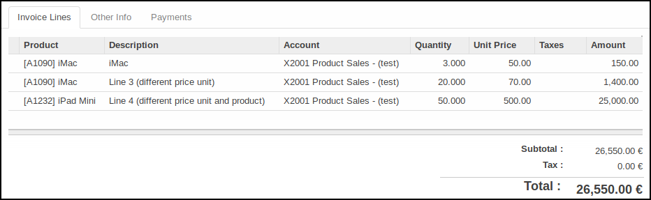

* go to the model for which you have configured a merging operation

* select items and click on 'More' and on the new button

* the opened pop up display the number of selected items

if some items doesn't match with the domain, a warning is displayed

* Click on the 'Apply' button to process

**Before the merge**

**After the merge**

