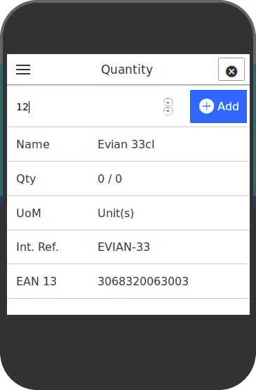

Authentication
--------------

The first screen asks Odoo credentials. The user should be member of the Odoo
'Purchase User' group.

Data Loading
------------

Once authenticated, some datas are cached : Active Products, partners flagged
as supplier, and draft Purchase Orders.

Purchase Order Selection
------------------------

Once datas are loaded, user can select an existing draft purchase order he
want to complete.

.. image:: ../static/src/img/phone_select_purchase_order.png

Alternatively, user can create a new purchase order, selecting a supplier.

Product Selection and Quantity Selection
----------------------------------------

Once the purchase order created or selected, the user can select a product,
scanning a barcode.

If the EAN13 barcode is recognized, some informations are displayed to be
sure that the product is the good one (name, internal code) and other
informations related to stock (quantity on hand and forecasted quantity)
User has to set a quantity to purchase and then validate.

Menu
----

A menu is available in each screen that allows user to navigates between
screens.

