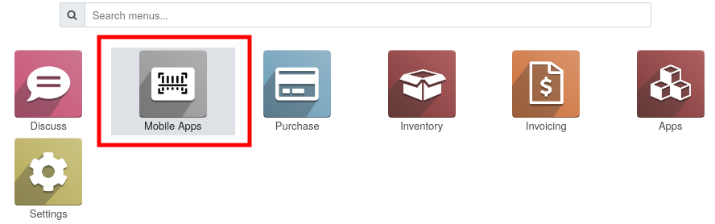

This module is a technical module that adds tools to write mobile applications like
``mobile_kiosk_purchase`` or ``mobile_kiosk_inventory`` modules, present in the same repository.

The name "kiosk" is based on full screen technology used in Odoo Core for some application like
in ``hr_attendance`` module, with the kiosk mode.

Visually, it adds a new main menu named "Mobile Apps".

