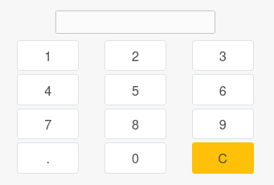

* Technically, this module add a new mixin ``mobile.kiosk.abstract`` that can be inherited
  to develop new mobile application.

* It also adds a light javascript and CSS framework for the same purpose

* it provides a new widget named "pad_widget", used to enter a numeric value.

