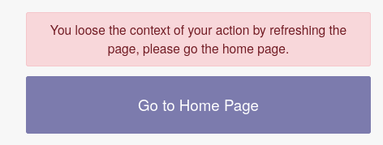

* For the time being, if the user click on refresh the page, he will use the
  context, and so has to do again the current action. It is due to a current Odoo
  limitation in the web framework.

* This module has been developped in a simple context. (A single locations, no lots, etc...)
  Some extra screen could be added to select locations, product lots, ...
  depending on if the user belong to some groups like "Multi-location group", ...
