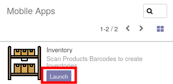
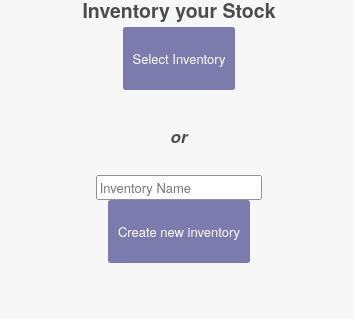
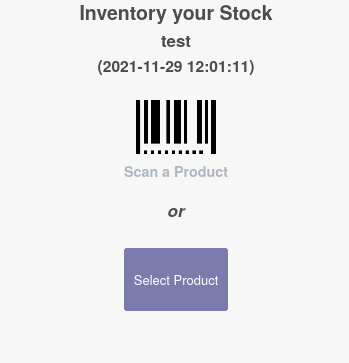
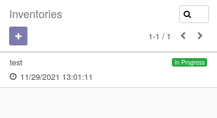
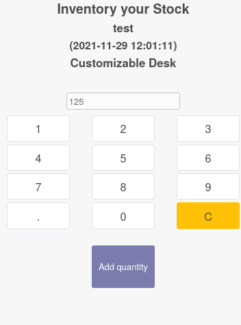
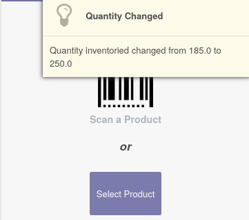

* Click on "Mobile Apps" Menu.

* Launch the "Inventory" application.

* Select an existing inventory or create a new one.

To create a new inventory, enter a name, and click on "Create new Inventory"

To select an existing inventory, click on the according button, then select a pending
inventory in the list :

* The next page allows you to choose a product.

If you use a mobile with a barcode scanner, you can scan a barcode, to select
the product.

Otherwise, you can manually select a product, if it doesn't have a barcode set.

* The next page allows you to set a quantity. Tip a quantity, then click on the button
  "Add quantity"

Note
~~~~

If you scan twice the same product, a message will be displayed to inform the user
that the quantities has been summed.

