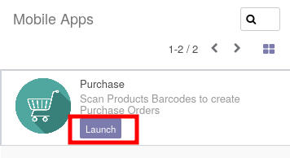
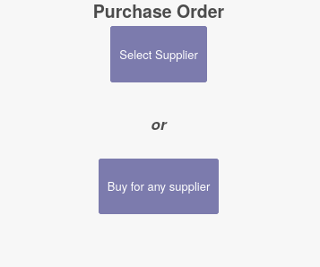
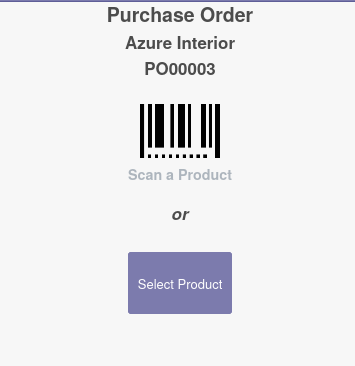
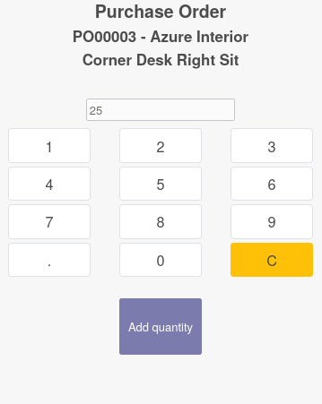

* Click on "Mobile Apps" Menu.

* Launch the "Purchase" application.

* The next page proposes to the user to select a supplier, or to buy for any supplier.

* Click on Select a supplier and click then on the supplier you want.

* The next page allows you to choose a product.

If you use a mobile with a barcode scanner, you can scan a barcode, to select
the product.

Otherwise, you can manually select a product, if it doesn't have a barcode set.

* The next page allows you to set a quantity. Tip a quantity, then click on the button
  "Add quantity"

Note
~~~~

you can also, at the first page, click on "Buy for any supplier".
That case, each time you set a quantity for a product, it will add new purchase order line
on a existing purchase order related to the main supplier. If the purchase order doesn't exist,
it will be created.
