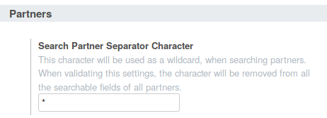

* Go to 'Settings / Configuration / General Settings'

* Choose the character that will be used to allow a search with multiple words

**Important Note**

When you do this settings, a process will remove this char from all your
partners in the fields ``name`` and ``email``.
