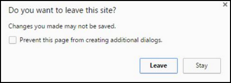

This module extends the functionality of Point of Sale Module to display
an extra pop up confirmation, in case of the user try to close the current
Point of Sale window.

It is usefull in a context where there are a lot of customers, to
prevent manipulation error that force user to reload all the Point of sale,
specially if users are using tactile screen.

This module disables too the "back" button in the point of sale.

