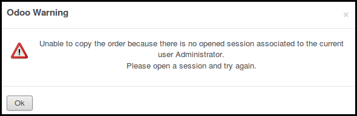

This module extends the functionality of point of sale to support the
possibility to duplicated orders of closed sessions.

By default on Odoo, if a user duplicates an order, the session of the new
order will be the session of the old one, that makes no sense.

This module fixes this problem.

