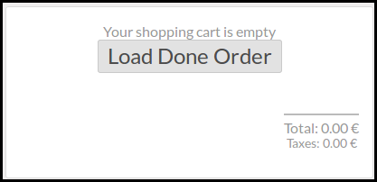

To use this module, you need to:

* Launch the point of sale

* Click on the new button 'Load Done Orders'

* the list of the last previous done orders are displayed.

* You can perform a research by name or PoS Reference field in the search box

* At the end of the line, buttons are available to make extra actions

.. figure:: ../static/description/pos_done_order_list.png
