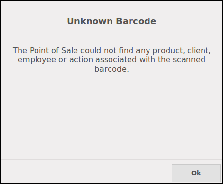

This module extends the functionality of point of sale to limit the
display of 'Unknown barcode'.

In Odoo, by default, when the user tip text with the keyboard a check is
processed if the speed is quick, to check if it is a barcode.

That's not very predictive and some undesired warning occured if:

* the user remove a text in a field (for exemple in the field to search customer)
* the user tip with the keyboard quickly.

The first case occures very often if the user leaves the key 'backspace' pressed.

This module will display a message only if the text matches exactly a given
pattern.
