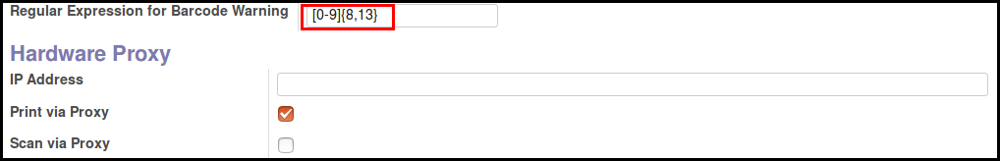

To configure this module, you need to:

* Go to Point of Sale / Configuration / Point of Sales

* Tip a regex in the new field 'Regular Expresssion for Barcode Warnings'

by default the pattern matches with text from 8 to 13 digits.

