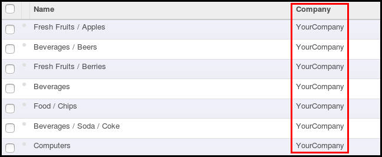

This module extends the functionality of point of sale to fully support
multi companies implementation and to allow you to separate PoS Categories
and PoS Sessions by companies.

**Technical information**

* ``pos.session`` : Add new related ``company_id`` field and restrict
  access right
* ``pos.category`` : Add new  ``company_id`` field and restrict access
  right
* Add the ``company_id`` field in all the search / tree / form views of the
  Point of Sale.

