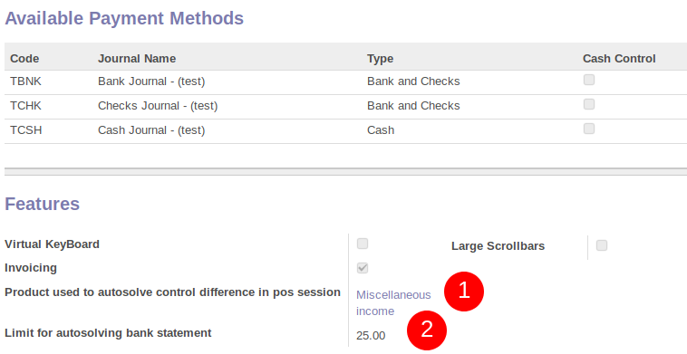

To configure this module, you need to:

* Go to Invoicing / Configuration / Journals / Journals

* Check the box 'Bank and Checks Control' if you want to enable this feature
  for this journal
  
.. figure:: ../static/description/account_journal_bank_setting.png

For quickly automatic solve configuration :

* Go to Point of Sale / Configuration / Point of Sales / <your session>
* Choose a "Product used to autosolve control difference in pos session" - Only 'Point of Sale Cash In/Out' products are possible
* (Not mandatory) Choose a limit to allow or not the user to autosolve control difference in pos - Set 0 if you don't want any limit.

