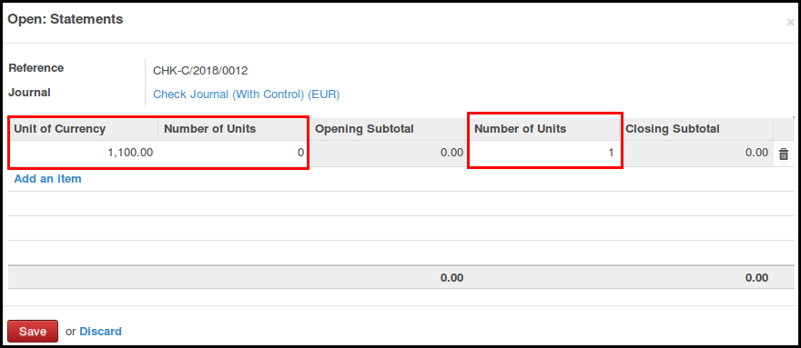
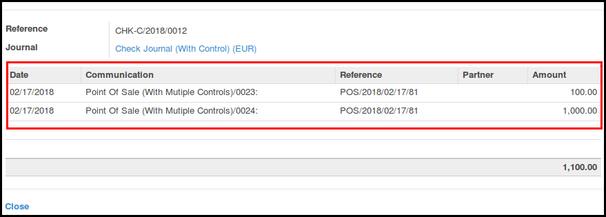

This module extends the functionality of point of sale and to support
improved control during the close of the session.

* Allow user to control each statement. (not only the cash statement,
  by default)

.. figure:: ../static/description/pos_session_closing_form.png

* User should set the closing balance for all the statements

* User can access to the summary by payment methods for each statement

* So that, force user to have correct balance on each statement. If not,
  user should have to set Profit or Loss reason, using the OCA module
  ``pos_cash_move_reason``

* As the check is more complete, allow user to reopen a new session, if the
  first one is in a closing state.

Extra checks are done, to prevent user errors:

* It is not possible to click on the button 'Close Session' if there are some
  draft orders.
