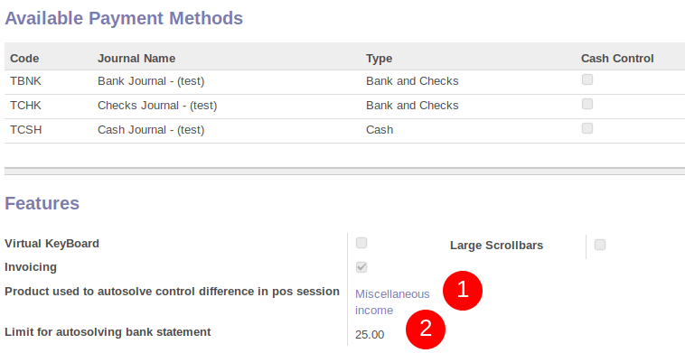

To configure this module, you need to:

* Go to Point of Sale / Configuration / Point of Sales / <your session>
* Choose a "Product used to autosolve control difference in pos session" - Only 'Point of Sale Cash In/Out' products are possible
* (Not mandatory) Choose a limit to allow or not the user to autosolve control difference in pos - Set 0 if you don't want any limit.

