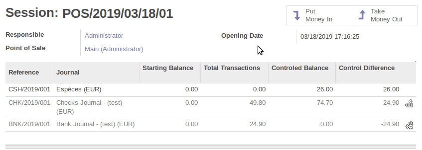

It allows to quickly solve multiple control differences in point of sale, thanks to a choosen product in POS config.
Used cash.box.out/in methods.

Parameters in POS config (see configuration part) defined the absolute limit when we can use the automatic solve button.
In this example, we set the limit to 25.

