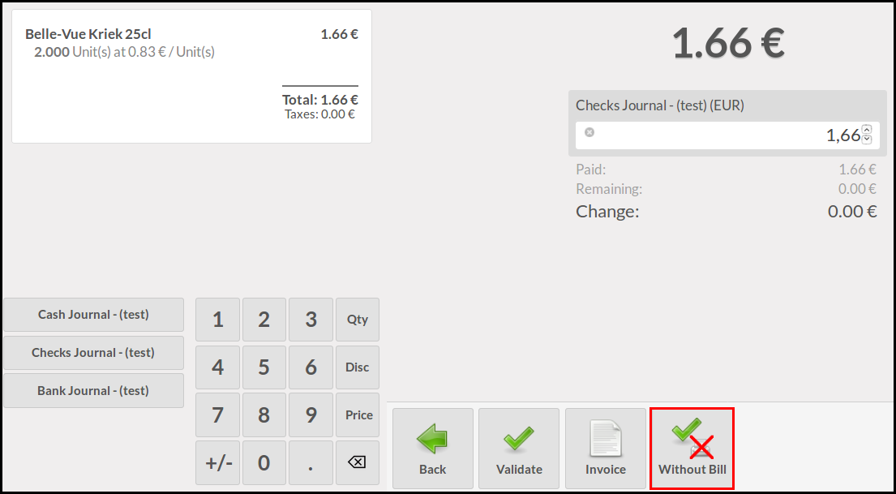

This module extends the functionality of point of sale to support the
possibility to validate orders without printing the bill.

For that purpose it adds a new button 'Without Bill' in the payment screen
that allows users to validate the order without printing the bill.

For the time being, this module works only in the print via proxy mode.

