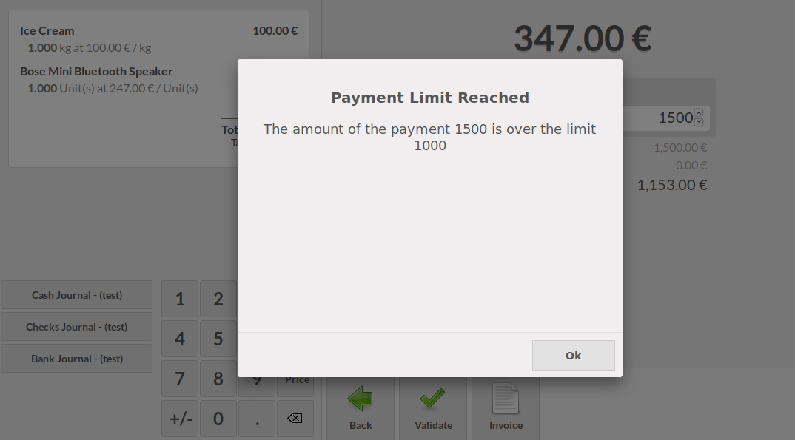

This module extends the functionality of point of sale to limit the possibility
to set a too much amount in the payment field.

Over a given limit, a message will be displayed to the user,
when he tries to confirm the order.

