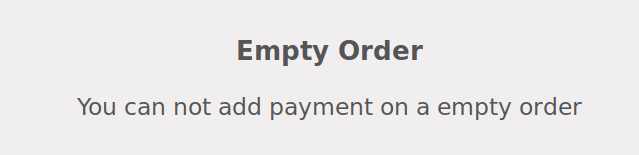

This module extends the functionality of point of sale to improve
payment usability.

**Prevent to add payment on empty order**

If the user try to click on a payment journal, this message will displayed
if the order is empty

**Do not set default payment amount by default**

The default mechanism that prefill the total amount of the order when
selecting a new payment method (except for 'cash') is disabled. The
user has to set manually the total amount.

 
