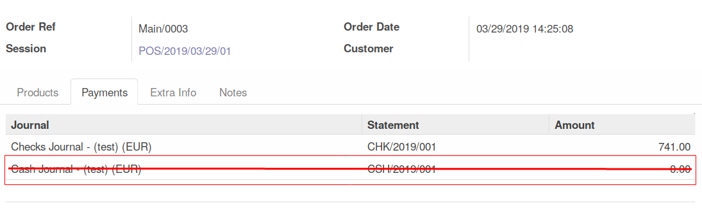
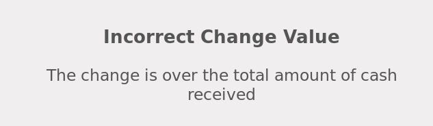
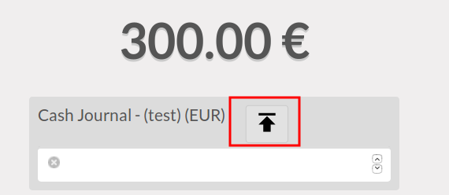

This module extends the functionality of point of sale to improve
payment usability.

**Prevent to add payment on empty order**

If the user try to click on a payment journal, this message will be displayed
if the order is empty

.. figure:: ../static/description/pos_error_add_payment_empty_order.png

**Do not allow to have many lines with 0 amount**

If there is a payment line with 0 amount, and the user tries to add a new
payment line, the previous payment line will be deleted and the new one will
be added.

**Do not save payment line with null amount**
If a user add a payment line with null amount, this line will be deleted,
when the order will be confirmed.

**Block the possibility to have more change than the cash received**

If the change is over the total amount of cash received, the following message
will be displayed.

**Button to up the amount to have no change**

A button is present if the remaining amount is positive.

by clicking on the button, the user will change the amount of the line,
to make the order paid, without change.

