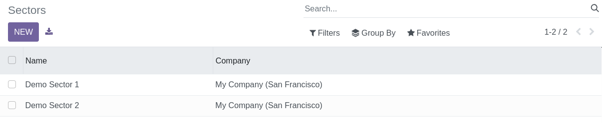
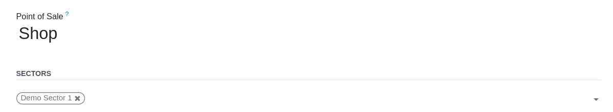
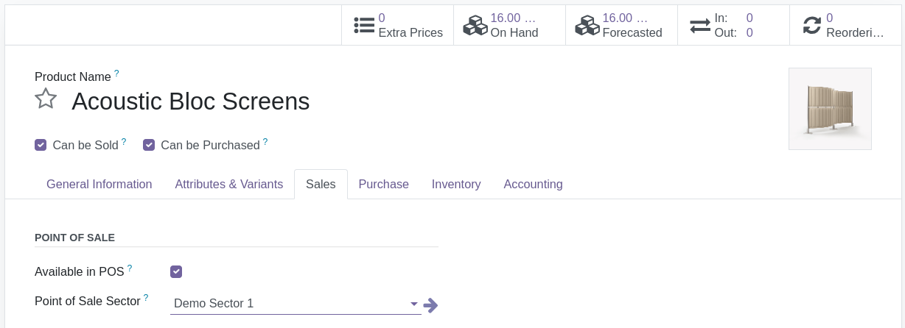

To configure this module, you need to:

- Go to Point of Sale / Configuration / Sectors
- Create your PoS Sectors

- Open your Point Of Sale configurations and set sectors

- Finally, edit your products and set a sector

