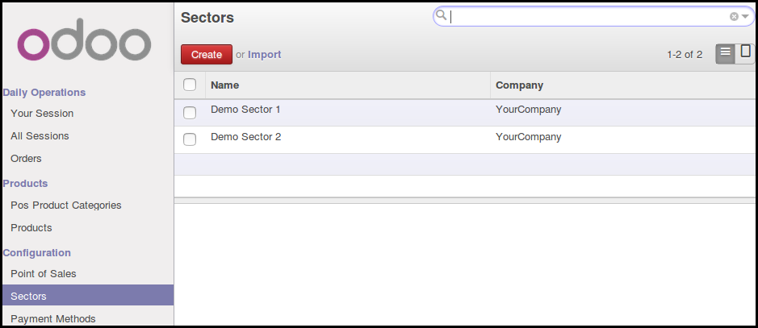
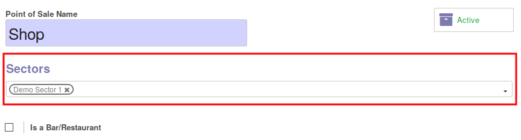
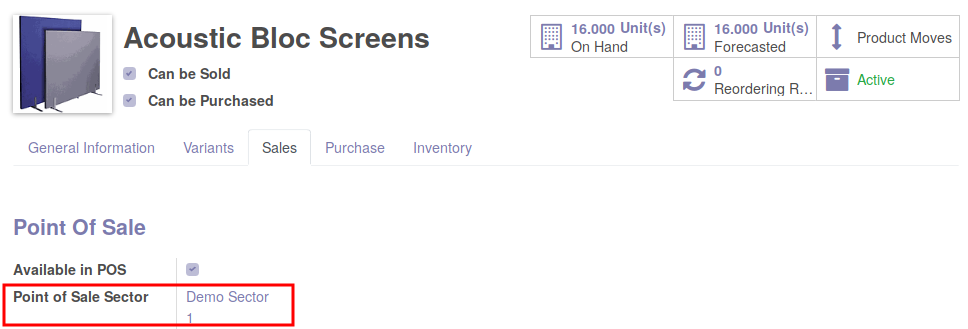

To configure this module, you need to:

* Go to Point of Sale / Configuration / Sectors

* Create your PoS Sectors

* Open your Point Of Sale configurations and set sectors

* Finally, edit your products and set a sector

