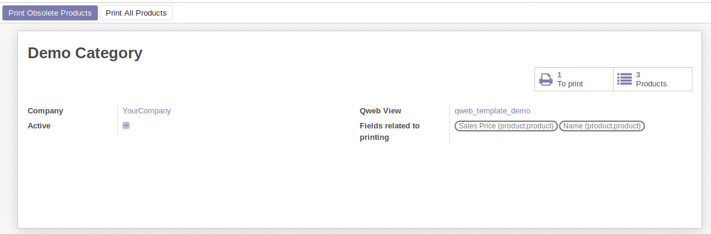
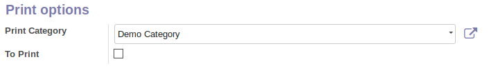

* Go to 'Sales' / 'Products' / 'Print Categories'
* Find or create new print categories of products
    * Set the fields that will trigger to print again the product label (e.g : name, sale price etc.)
    * Set the qweb view that will be used for this category

* Affect products to the categories dire
    * Go to 'Sales' / 'Products' / 'Product variants'
    * Go to your product in sales tab
    * Set a print category 

* You can set a default print category in res_company configuration settings
    * For each new product, it will be assigned to the print category

* To print your products, go to 'Sales' / 'Products' / 'Print Categories'
    * Choose between "Print Obsolete Products" or "Print All Products"

.. figure:: ../static/description/print_options.png
