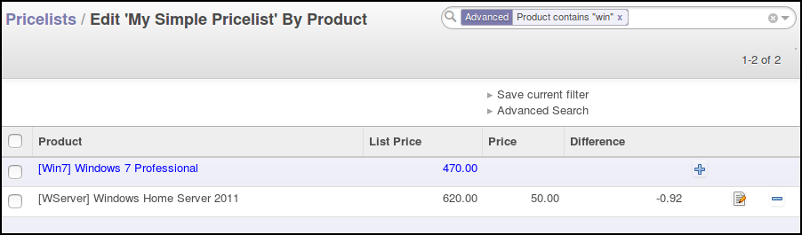
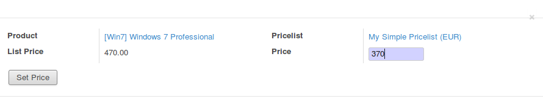
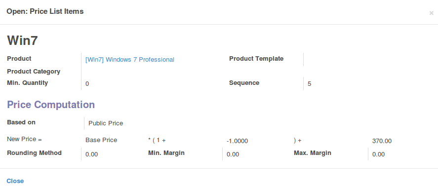

To use this module, you need to go to Sale / Configuration / Pricelists

* Check the box simple pricelist on your desired pricelist

* click then on the edit button, available on the tree or the form view

.. figure:: ../static/description/product_pricelist_tree.png

* you can then edit easily change the price for a given product with the
  buttons in the end of each lines.

* In the wizard, mention the new price you want to apply for this pricelist

* The according pricelist item will be created

