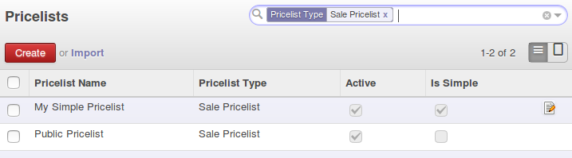
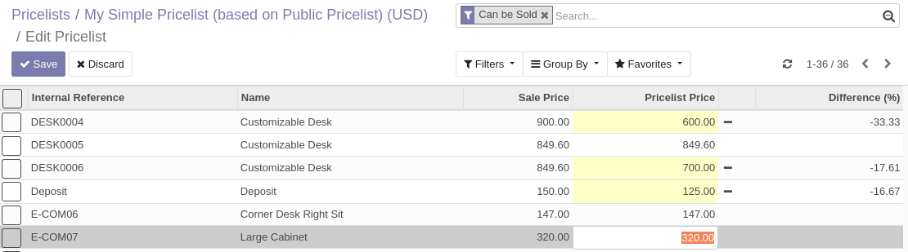
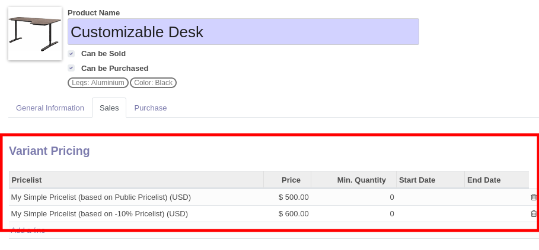

**Via Pricelist**

* Go to "Sales > Products > Pricelists"

* Click then on the edit button, available on the tree or the form view

* You can easily change the price for a given product with the
  buttons in the end of each lines.

**Via Products**

* Go to "Sales > Products > Product Variants"

* Open a product and click on the "Sales" Tab.

* edit prices per product and simple pricelist:

