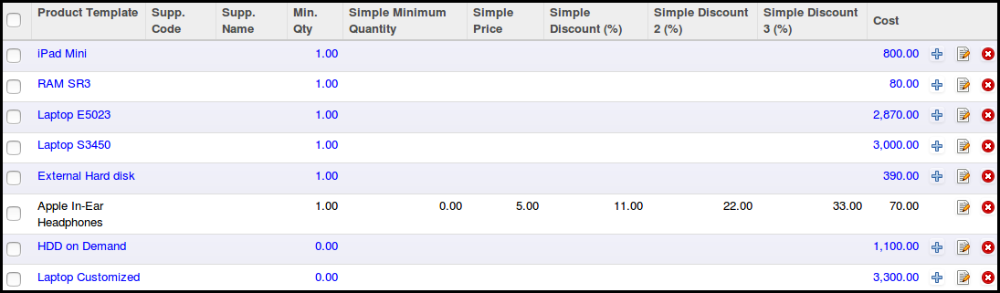

This module extends the functionality of purchase module to provide a
wizard to manage easily Supplierinfo

It displays a tree and editable view to edit quickly supplier info :

* possibility to update very quickly if there is only one line in
  pricelist_ids
* Possibility to see and update lines if there are many pricelist_ids

It displays on partner form and kanban view, the quantity of products supplied
by the partner and a link to see the products.

Users have the possibility to select various products to create quickly a new
draft purchase order
