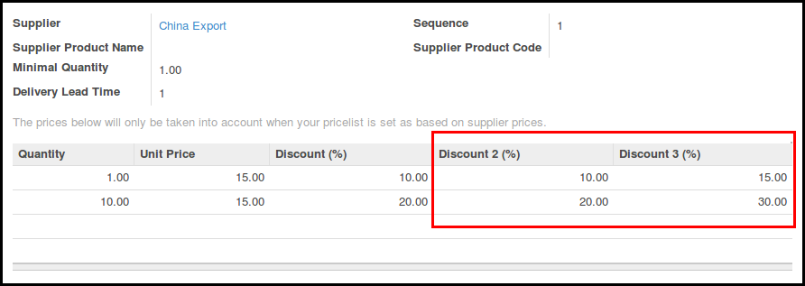

Go to Purchase > Products, open one product, and edit or add a record on the
*Suppliers* section of the *Procurements*. You will see in the prices section
in the down part three columns *Discount (%)*. You can enter here
the desired discounts for that quantity.

When you make a purchase order for that supplier and that product, discounts
will be put automatically.
