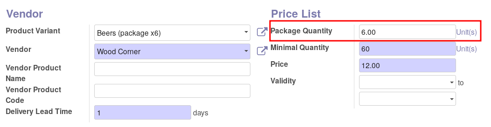

This module extends the functionality of purchase module to support package
quantity.

In the product supplierinfo, add a "Package Qty" field to register how many
purchase UoM of the product there are in the package the supplier uses.
All purchase lines for this product+supplier must have a quantity that is a
multiple of that package quantity.

For example:

* A supplier sells beers with a price per unit, thus the purchase UoM is PCE.
* The supplier put them in 6pcs boxes, and the purchaser have to buy a multiple
  of 6.
* The supplier has a minimum quantity of 60.

So the settings of the product will be the following :

