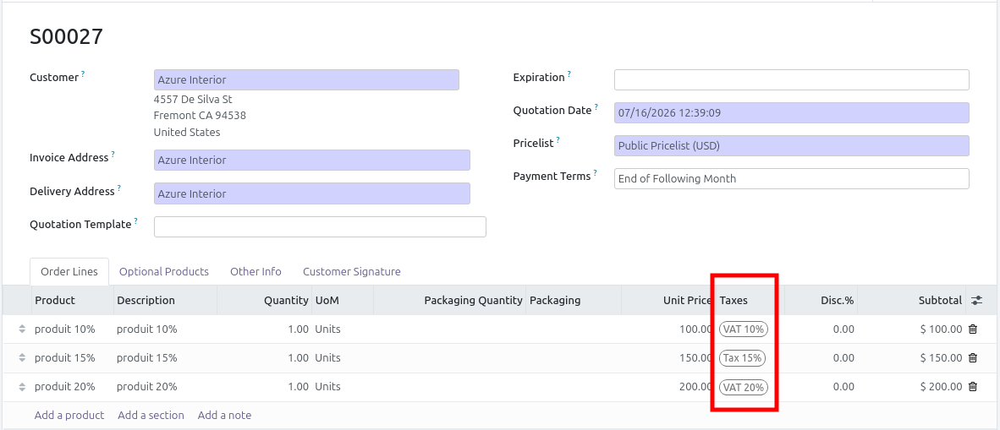
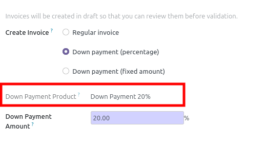
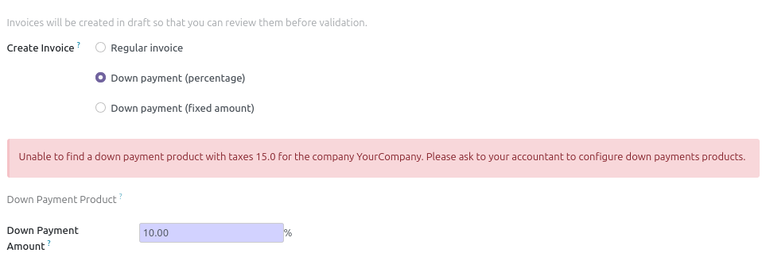

- Create a new order and select many products with many vat.

- during the down payment process, the down payment product with the
  higher VAT will be selected.

  (If no product exists with the higher VAT, the error will be displayed)

Note: This module disable the possibility to create down payment on the fly
for accountant, with vat and account defined, if no product exists.
