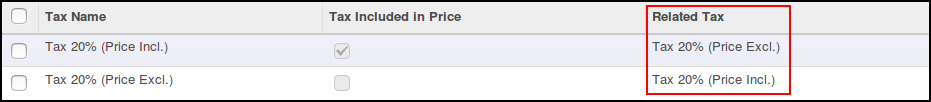
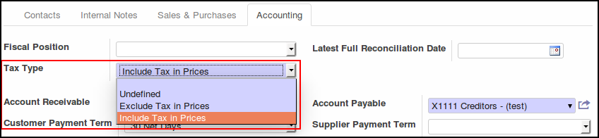

On account.tax, add a new field 'simple_tax_id' that is the according tax
with or without tax included. Sample:

* TAX A: VAT 10% included
* TAX B : VAT 10% excluded
* TAX A and TAX B will be linked together

On res.partner, add a new field selection 'simple_tax_type' with
the following values:

* 'none' : (default) undefined, the Tax will be the tax of the product
* 'excluded': All price will be recomputed with Tax excluded
* 'included': All price will be recomputed with Tax inluded

