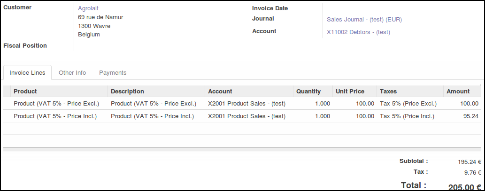
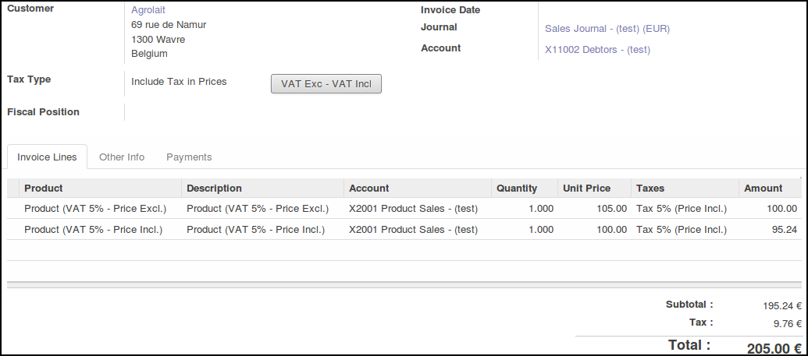
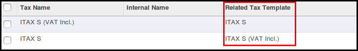

This module is useful in the following case:

* Odoo is implemented in a country with simple Taxes system, (Like in France)
  with generaly only one Tax type='percent'. (VAT)
* Users define allways product price with VAT included. (or allways excluded)
* Some customers / suppliers wants quotation / invoices with the other system

Possibility to switch between Price VAT Included and Price VAT Excluded
when editing a Account Invoice

** Invoices with Mixed Taxes**

** Invoices with Harmonized Taxes**

On account.tax.template, add a new field 'simple_template_id' that is
the according template with of without tax included.

**Related Modules**

This following modules provide the same behaviour as glue modules, if sale
or purchase module are installed.

* ``simple_tax_sale``
* ``simple_tax_purchase``
