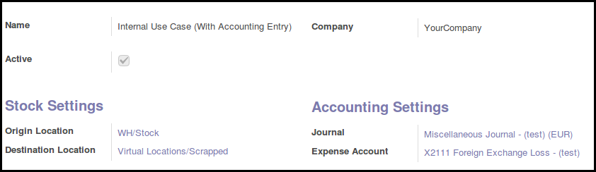

* Go to 'Stock' / 'Settings' / 'Internal Use Types'
* Create new item
* set source and destination locations
* optionnaly, define accounting settings, if you want to generate accounting
  move, once the internal use is confirmed.

