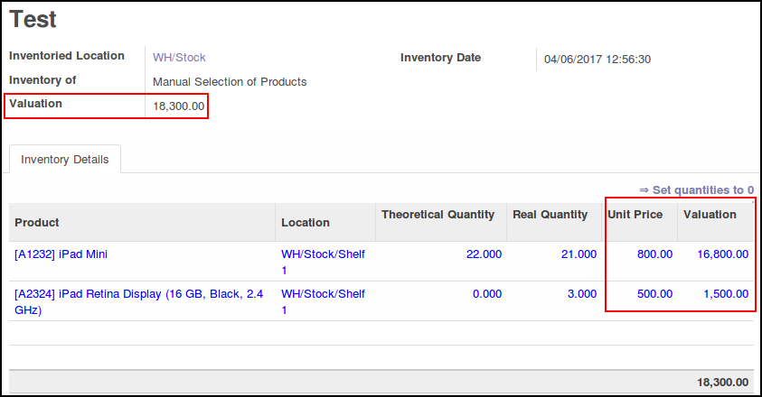

This module add simple valuation on stock inventories, based on standard_price
of each product.

A new computed field ``valuation`` is added on ``stock.inventory`` and
``stock.iventory.line`` models so as to be able to calculate the total
valuation of one inventory.

This module can be usefull when you don't use valuation by quants.

