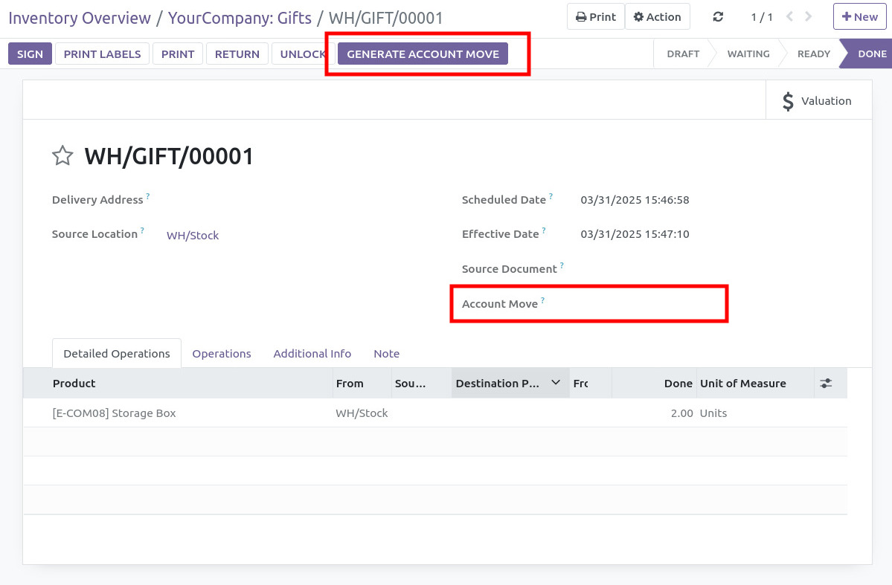
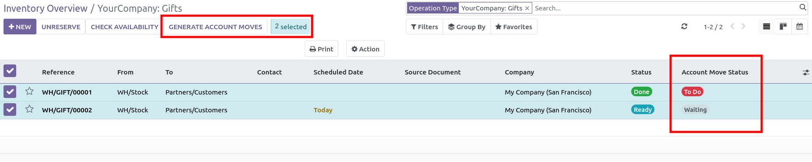
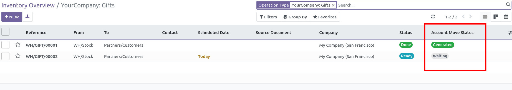

- Create a new Transfer (stock picking type) with your new Operation
  Type
- Validate it and button GENERATE ACCOUNT MOVE appears

- Click on it to generate Account Move on Form View
- Or click on several pickings to generate Account Move.

